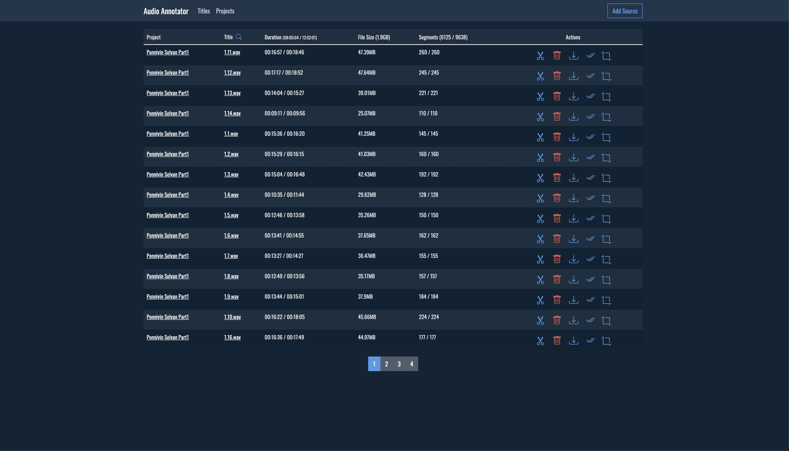

## Sample Audio generated by Finetuned Tactron2 Model

#### ```ஒருவர் சேர்த்துள்ள செல்வங்களிலேயே தலையான செல்வமாக கருதப்படுவது, அவர் தன் செவி வழியாக சேர்த்துள்ள அறிவாகிய செல்வமாகும்.```

<audio controls>
  <source src="./training/sample.wav" type="audio/mpeg">
  Your browser does not support the audio element.
</audio>

[Listen to the audio](./training/sample.wav)

## Dev inside Container

- Run following docker-compose commands

```
  docker-compose -f ./docker-compose.dev.yml build
  docker-compose -f ./docker-compose.dev.yml up
```

- This will start `segmenter - 8000`, `postgres db - 5432` and `redis`
- Then use VS Code Remote Dev Extension to connect to running container
- Once connected to container, goto `server` and install all the npm packages
- And run `npm run start:dev`
- Same goes for `clinet`. Goto clinet and run `npm start`
- Now connect to `localhost:3001` for clinet
- And `localhost:3000` for server

> In Short

```
  docker-compose -f ./docker-compose.dev.yml build
  docker-compose -f ./docker-compose.dev.yml up

  cd server
  npm install
  npx prisma migrate dev
  npx prisma generate
  npm run start:dev

  cd client
  npm install
  npm start
```

### Projects List View



### Annotator View - Audio Waveform, Text Description


### Validator View


## Prod Build

- TODO:
